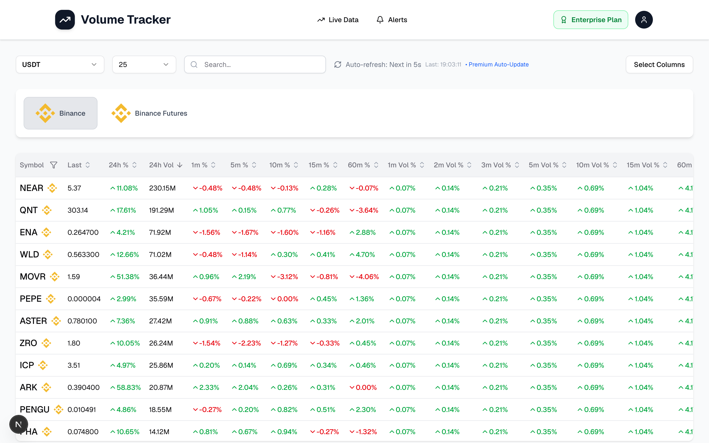
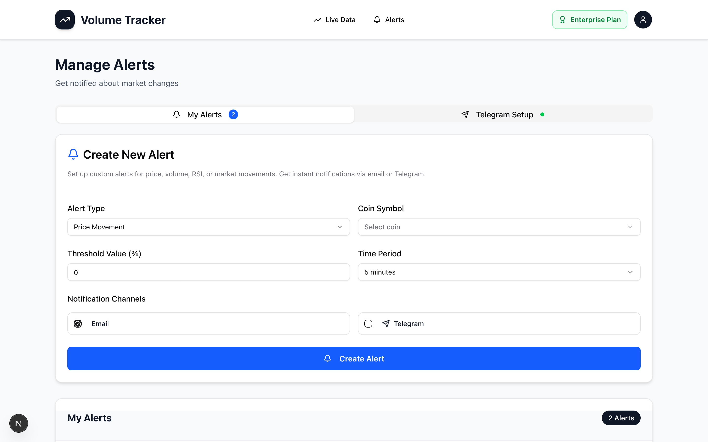
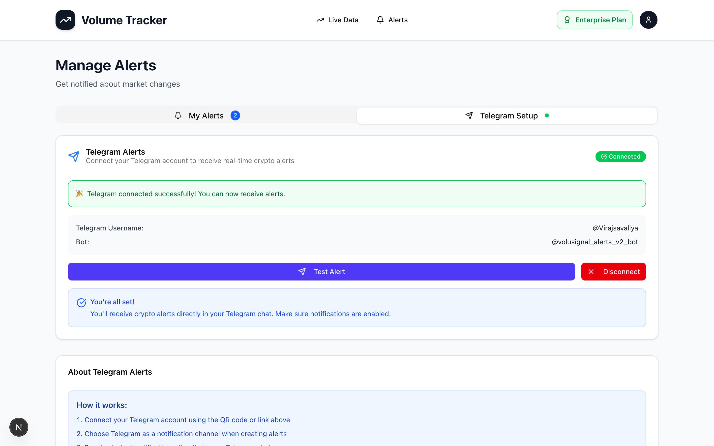
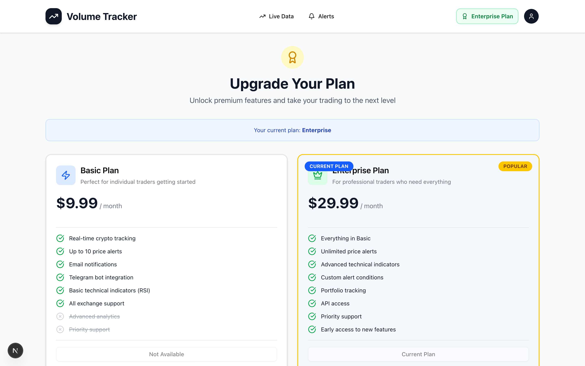
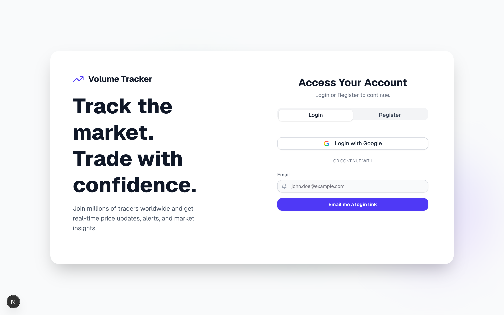
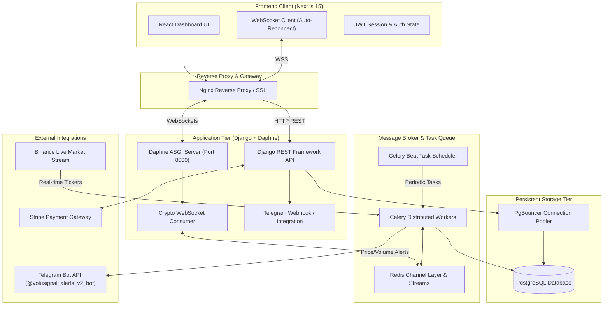

# ⚡ VoluSignal — Real-Time Crypto Trading Intelligence & Volume Tracker

<div align="center">

[](LICENSE)
[](https://nextjs.org/)
[](https://www.djangoproject.com/)
[](https://channels.readthedocs.io/)
[](https://www.typescriptlang.org/)
[](https://redis.io/)
[](https://www.postgresql.org/)
[](https://www.docker.com/)

**High-Frequency Crypto Volume Scanner, Real-Time Market Analytics & Automated Telegram Signals**

[🌐 Production Website](https://volusignal.com) • [📖 System Architecture](#-system-architecture) • [🚀 Quick Start](#-quick-start) • [📡 API Reference](#-api--websocket-reference) • [📄 License](#-license)

</div>

---

## 📸 Application Showcase

### 📊 Real-Time Volume & Market Dashboard
Full-spectrum market overview tracking live USDT trading pairs directly from Binance with sub-100ms latency, multi-timeframe volume percentage surges (1m, 2m, 3m, 5m, 10m, 15m, 60m), and live order flow spreads.



---

### 🚨 Multi-Channel Alert Engine
Create customizable trigger rules based on sudden price breakouts, multi-minute volume surges, RSI divergence, or custom threshold percentages with instant automated notification dispatches.



---

### 🤖 Telegram Bot Integration & Instant Alerts
Zero-latency automated Telegram bot signals delivering formatted alert cards with direct chart links, real-time volume multipliers, and instant market alerts.



---

### 💳 Tiered Subscription & Plan Management
Production-ready plan tier management (Basic, Enterprise) integrated with Stripe billing and real-time permission enforcement across WebSocket streams.



---

### 🔐 Modern Authentication & User Access Portal
Clean authentication flow featuring JWT authentication, automated inactivity auto-logout protection, Google SSO support, and session continuity.



---

## ✨ Key Features

- **⚡ Sub-100ms Real-Time Streaming**: High-throughput Daphne ASGI WebSocket server streaming Binance price updates, volume velocity, and bid/ask spreads directly to the Next.js frontend.
- **📈 Multi-Timeframe Volume Profiling**: Real-time volume breakout metrics across `1m`, `2m`, `3m`, `5m`, `10m`, `15m`, and `60m` candles to detect whale activity and institutional momentum early.
- **🎯 Dynamic Technical Indicators**: Automatic calculation of Relative Strength Index (RSI 1m/3m/5m/15m), net volume flow, buy/sell volume imbalance, and 24h percentage swings.
- **🤖 Autonomous Telegram Bot Alerting**: Background task workers continuously evaluate market conditions against user rules and dispatch real-time rich alerts to paired Telegram accounts.
- **🛡️ Enterprise-Grade Architecture**: High-capacity PostgreSQL with PgBouncer connection pooling (scaling 100 DB connections to 2,000+ client requests) and Redis caching layers.
- **🩺 Self-Healing Automation**: Integrated operational supervisor monitoring disk space, Celery queue health, WebSocket reconnects, and auto-restarting degraded containers.
- **🔒 Robust Security**: Strict JWT token rotation, CORS origin isolation, SQL injection prevention via Django ORM, rate-limiting on sensitive endpoints, and security headers.

---

## 🏗️ System Architecture



---

## 💻 Tech Stack

| Domain | Technology | Description |
| :--- | :--- | :--- |
| **Frontend** | [Next.js 15](https://nextjs.org/) (App Router) | High-performance React 19 framework with SSR and streaming |
| **Styling** | [Tailwind CSS](https://tailwindcss.com/) & [Radix UI](https://www.radix-ui.com/) | Custom dark/light mode UI components with Lucide icons |
| **Language** | [TypeScript](https://www.typescriptlang.org/) | Strict type checking across API responses and state |
| **Backend API** | [Django 4.2](https://www.djangoproject.com/) + [DRF](https://www.django-rest-framework.org/) | RESTful API endpoints for auth, alerts, and settings |
| **ASGI / Realtime** | [Django Channels 4](https://channels.readthedocs.io/) + [Daphne](https://github.com/django/daphne) | Asynchronous WebSocket server handling bi-directional data |
| **Task Queue** | [Celery 5](https://docs.celeryq.dev/) + [django-celery-beat](https://github.com/celery/django-celery-beat) | Distributed background workers and periodic schedulers |
| **In-Memory Cache** | [Redis 7](https://redis.io/) | Channel layer backend, Celery broker, and high-speed cache |
| **Database** | [PostgreSQL 15](https://www.postgresql.org/) | Relational database for accounts, subscriptions, and metrics |
| **Connection Pool**| [PgBouncer](https://www.pgbouncer.org/) | Lightweight connection pooler ensuring low database load |
| **Data Provider** | [Binance API & WebSockets](https://binance-docs.github.io/apidocs/) | Ingestion of 2,000+ crypto pairs and live tick streams |
| **Containerization**| [Docker](https://www.docker.com/) & [Docker Compose](https://docs.docker.com/compose/) | Turnkey container orchestration for local dev & production |

---

## 📁 Repository Structure

```
crypto-tracker/
├── backend/                        # Django REST API + WebSocket Server
│   ├── core/                       # Core application domain
│   │   ├── binance_realtime.py     # Binance live market stream client
│   │   ├── consumers.py            # WebSocket Channel consumers
│   │   ├── models.py               # CryptoData, User, and Alert models
│   │   ├── tasks.py                # Celery background calculation tasks
│   │   ├── telegram_bot.py         # Telegram bot handler & dispatcher
│   │   ├── telegram_views.py       # Telegram pairing & test endpoints
│   │   ├── views.py                # REST API views & authentication
│   │   └── management/commands/    # CLI tools (populate_usdt_only, etc.)
│   ├── project_config/             # Django settings, ASGI/WSGI, Celery config
│   ├── Dockerfile                  # Multi-stage optimized Python container
│   ├── requirements.txt            # Python dependencies
│   └── start.sh                    # Container startup entrypoint
│
├── frontend/                       # Next.js 15 Client Application
│   ├── src/
│   │   ├── app/                    # Next.js App Router pages
│   │   │   ├── page.tsx            # Landing & authentication page
│   │   │   ├── dashboard/page.tsx  # Live crypto market dashboard
│   │   │   ├── alerts/page.tsx     # Alert creation & Telegram setup
│   │   │   └── upgrade-plan/       # Subscription plans & checkout
│   │   ├── components/             # Reusable UI & domain components
│   │   └── lib/                    # Authentication, API, and config utilities
│   ├── Dockerfile.dev              # Development container with hot-reload
│   └── package.json                # Frontend packages & scripts
│
├── docs/                           # Architecture, guides, and assets
│   ├── DOCUMENTATION.md            # Detailed technical specification
│   ├── README.md                   # Operator manual
│   └── screenshots/                # Application UI screenshots
│       ├── dashboard.png           # Live market dashboard preview
│       ├── alerts.png              # Alert management preview
│       ├── telegram-setup.png      # Telegram bot connection preview
│       ├── pricing.png             # Pricing & plans preview
│       └── landing-page.png        # Authentication portal preview
│
├── nginx/                          # Nginx reverse proxy configurations
├── pgbouncer/                      # PgBouncer connection pooler configs
├── scripts/                        # Automated maintenance & deployment scripts
│   ├── auto-repair.sh              # Self-healing operational supervisor
│   └── setup-automation.sh         # Cron monitoring installation
├── docker-compose.local.yml        # Local development full-stack compose
├── docker-compose.yml              # Production stack compose configuration
├── LICENSE                         # MIT Open Source License
└── README.md                       # Main project documentation
```

---

## 🚀 Quick Start

### Prerequisites
- [Docker](https://docs.docker.com/get-docker/) & [Docker Compose](https://docs.docker.com/compose/install/) (v2.20+)
- Git

### 1. Clone the Repository
```bash
git clone https://github.com/virajsavaliya/crypto-tracker.git
cd crypto-tracker
```

### 2. Environment Configuration
Copy the provided environment template:
```bash
cp .env.example backend/.env
```

Key environment configuration variables:
```bash
# Backend Settings
DEBUG=True
SECRET_KEY=your-django-secret-key
DB_HOST=db
DB_PORT=5432
DB_NAME=crypto_tracker_db
DB_USER=postgres
DB_PASSWORD=postgres
REDIS_URL=redis://redis:6379/0
CELERY_BROKER_URL=redis://redis:6379/1

# Telegram Alerts Integration
TELEGRAM_BOT_TOKEN=your-telegram-bot-token
TELEGRAM_BOT_USERNAME=your_bot_username
```

### 3. Launch with Docker Compose
Start the complete stack (PostgreSQL, Redis, Django Backend, Celery Worker, Celery Beat, and Next.js Frontend) in one command:

```bash
docker-compose -f docker-compose.local.yml up -d --build
```

Verify service status:
```bash
docker-compose -f docker-compose.local.yml ps
```

### 4. Populate Live USDT Pairs
Run the optimized data ingest command to fetch live Binance crypto pairs and calculate initial metrics:
```bash
docker exec crypto_backend python manage.py populate_usdt_only
```

### 5. Access the Platform
- **Frontend Dashboard**: [http://localhost:3000](http://localhost:3000)
- **Backend REST API**: [http://localhost:8000/api/](http://localhost:8000/api/)
- **Health Check**: [http://localhost:8000/healthz/](http://localhost:8000/healthz/)

---

## 📡 API & WebSocket Reference

### 🔌 WebSocket Real-Time Stream
Connect to the Daphne ASGI WebSocket server:
```
ws://localhost:8000/ws/crypto/
```

**Client Authentication & Subscription:**
```json
{
  "action": "subscribe",
  "currency": "USDT",
  "token": "<JWT_ACCESS_TOKEN>"
}
```

**Incoming Live Tick Payload:**
```json
{
  "type": "price_update",
  "data": [
    {
      "symbol": "BTCUSDT",
      "last_price": 85536.01,
      "price_change_percent_24h": 5.24,
      "quote_volume_24h": 1381615193.0,
      "bid_price": 85536.00,
      "ask_price": 85536.01,
      "rsi_1m": 51.26,
      "m1_vol_pct": 0.0694,
      "m5_vol_pct": 0.35
    }
  ]
}
```

---

### 🌐 REST API Endpoints

#### Authentication & Account
| Method | Endpoint | Description |
| :--- | :--- | :--- |
| `POST` | `/api/register/` | Register new user account |
| `POST` | `/api/request-login-token/` | Request passwordless magic link token |
| `POST` | `/api/login-with-token/` | Validate token and obtain JWT access/refresh pair |
| `GET` | `/api/user/` | Retrieve current authenticated user profile & plan tier |
| `POST` | `/api/token/refresh/` | Refresh expired JWT access token |

#### Market Data & Tickers
| Method | Endpoint | Description |
| :--- | :--- | :--- |
| `GET` | `/api/binance-data/?page=1&limit=25` | Paginated, filterable crypto pairs with RSI & volume |
| `POST` | `/api/manual-refresh/` | Trigger immediate server-side data refresh from Binance |

#### Alerts & Telegram Automation
| Method | Endpoint | Description |
| :--- | :--- | :--- |
| `GET` | `/api/alerts/` | List active user alerts |
| `POST` | `/api/alerts/` | Create new price / volume alert rule |
| `DELETE` | `/api/alerts/<id>/` | Remove an existing alert rule |
| `GET` | `/api/telegram/status/` | Check Telegram bot pairing connection status |
| `GET` | `/api/telegram/setup-token/` | Generate one-time pairing token for Telegram bot |
| `POST` | `/api/telegram/test-alert/` | Dispatch test notification to connected Telegram |
| `POST` | `/api/telegram/disconnect/` | Unlink Telegram account |

---

## 🤖 Automated Self-Healing System

VoluSignal incorporates a self-healing operational layer designed for 99.9% uptime:

```bash
# Run automated repair diagnostic check
./scripts/auto-repair.sh

# Install continuous health supervision cron (every 5 minutes)
./scripts/setup-automation.sh
```

**Automated Supervisors:**
- ✅ **Memory & Resource Monitor**: Auto-restarts leaking workers when memory exceeds thresholds.
- ✅ **Database & Redis Liveness Probe**: Detects stale connections and resets connection pools.
- ✅ **WebSocket Reconnection Daemon**: Re-establishes dropped Binance feed sessions automatically.
- ✅ **Disk Cleaner**: Trims container log files and Docker cache to prevent server disk starvation.

---

## 🤝 Contributing

Contributions are welcome! Please follow these steps:

1. Fork the repository
2. Create your feature branch (`git checkout -b feature/amazing-feature`)
3. Commit your changes (`git commit -m 'feat: add amazing feature'`)
4. Push to the branch (`git push origin feature/amazing-feature`)
5. Open a Pull Request

---

## 📄 License

This project is licensed under the **MIT License** — see the [LICENSE](LICENSE) file for details.

Copyright &copy; 2026 **Viraj Savaliya**. All rights reserved.
